# Cala's Pokecom BASIC Version 0.8 日本語マニュアル

対象機種：ClockworkPi PicoCalc + Raspberry Pi Pico 2 W（RP2350）  
Copyright (C) 2026 Cala Maclir

> 本書はファームウェアVersion 0.8を対象とします。

## 1. はじめに

Cala's Pokecom BASICは、ClockworkPi PicoCalcとRaspberry Pi Pico 2 Wの組み合わせだけで、プログラムの作成、保存、実行、グラフィック表示、通信を行えるBASIC環境です。RetroMiniBASICの言語処理系を基盤に、PicoCalcのLCD、STM32キーボード／システムコントローラー、SDカード、電源管理と、Pico 2 WのWi-Fi機能およびシリアル通信を統合しています。Wi-FiはPicoCalc本体ではなく、Pico 2 W内蔵のCYW43439（Pico SDKのCYW43ドライバ）が提供します。

Version 0.8では、Pico 2 WのネイティブUSBをUSB CDC + Mass Storage Class（MSC）の複合デバイスとして動作させ、PicoCalcのSDカードをWindowsから利用できるようにしました。SDカードの所有権をCPBとUSBホストの間で排他的に切り替え、Safe Eject後の通常返却、緊急用のForce Disconnect、SD-backed ProgramStoreの再検証を行います。Version 0.75までのProgram Storage、YMODEM／XMODEM、Wi-Fi File Server、3行ステータスなども引き続き利用できます。

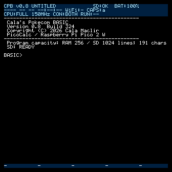

### 起動時の初期状態

- CPU：FULL 150 MHz
- Wi-Fi：OFF
- Wi-Fi File Server：OFF
- USB Mass Storage：OFF
- Program Storage Mode：保存された設定（初期値AUTO）
- SDカードのルートディレクトリに`AUTORUN.BAS`がある場合だけ自動実行

Wi-FiとFile Serverは安全のため自動起動しません。CPUプロファイルを変更しても、再起動時にはFULL 150 MHzへ戻ります。

## 2. ファームウェアの導入

1. 公開用GitHubリポジトリのReleasesから`Cala-Pokecom-BASIC-v0.8-pico2w.uf2`をダウンロードします。
2. Pico 2 WをPicoCalcから取り外し、Pico 2 W基板上のBOOTSELボタンを押したまま、Pico 2 W側のUSB端子（Micro-USB）でPCへ接続します。
3. BOOTSELで表示されるUSB mass-storage driveへUF2をコピーします。
4. Pico 2 WをPicoCalcへ戻します。
5. FAT32形式のSDカードを挿入してPicoCalcを起動します。

ClockworkPi公式のSDカード作成手順は、主パーティションをFAT32で作成します。本ファームウェアもFAT32を標準手順として推奨し、pico-vfs／FatFsでマウントします。マウントに失敗しても自動フォーマットしません。

起動画面には製品名、Version 0.8、Build番号、プログラム容量、SD状態が表示されます。ローカルビルドではBuild番号の代わりに`local`と表示されます。


## 3. 画面構成

通常のBASIC画面は、上部の3行ステータス、中央のコンソール、最下段のFキー行で構成されます。ステータス3行とFキー行はスクロールしません。

### 3.1 ステータス表示

| 行 | 表示内容 | 例 |
|---|---|---|
| 1 | バージョン、ファイル名、編集済み、SD、バッテリー | `CPB v0.8 PICOCALC_MAND* SD:OK BAT:87%+` |
| 2 | 日付、時刻、Wi-Fi、Caps Lock | `2026-09-21 15:44:32 WiFi:+ CAPS:A` |
| 3 | CPU、クロック、コンソール、RUN時間 | `CPU:ECO 75MHz CON:BOTH RUN:4.709s` |

記号の意味：

- ファイル名末尾の`*`：読み込み後に編集されています。
- バッテリー末尾の`+`：充電中です。
- `WiFi:-`：Wi-Fi OFF
- `WiFi:*`：Wi-Fi ON、未接続
- `WiFi:+`：接続済み
- `CAPS:A`：Caps Lock ON
- `CAPS:a`：通常入力

3行の背景色は選択したステータステーマで統一されます。`SCREEN`や`CLS`を使うグラフィックプログラムの終了後、BASICプロンプトに戻るとステータスとFキー行が復元されます。

### 3.2 Fキー行

最下段にはF1～F5へ割り当てたファイル名が表示されます。Shiftを押している間は同じ5か所がF6～F10の表示へ切り替わります。登録内容はControl Centerの`Quick Load Keys`で変更できます。

各表示枠では`.BAS`を省略した短い登録名を表示します。実際のLOAD／RUN対象は登録されたファイルです。

### 3.3 RUN終了表示

プログラム実行後には、実行時間を表示してBASICプロンプトへ戻ります。画面下端でスクロールが起きた場合も、実行時間表示とプロンプトが連続して表示されます。

```text
[RUN] 0m 0.112s
BASIC>
```

## 4. BASICの基本操作

### 4.1 プログラムの入力

行番号を付けて入力するとプログラムへ登録されます。同じ行番号を入力すると置換され、行番号だけを入力すると削除されます。

```basic
10 PRINT "HELLO, PICOCALC!"
20 FOR I=1 TO 10
30 PRINT I
40 NEXT I
50 END
```

`RUN`で実行、`LIST`で表示、`NEW`で消去します。

### 4.2 直接モード

行番号のないBASIC文はすぐに実行されます。

```text
BASIC> PRINT 2+3*4
14
BASIC> A=10
BASIC> PRINT A
10
```

`CLEAR`は直接モードの変数を消去します。`NEW`はプログラムと直接モードの変数を消去します。

### 4.3 REPLコマンド一覧

| コマンド | 内容 |
|---|---|
| `LIST` | 登録プログラムを表示 |
| `RUN` | プログラムを実行 |
| `PROFILE [ON/TIME/OFF/SHOW/RESET]` | RUN時間プロファイルを制御 |
| `NEW` | プログラムと直接モード変数を消去 |
| `CLEAR` | 直接モード変数を消去 |
| `CLS` | 画面を消去 |
| `FILES` / `DIR` | SDカードのルートディレクトリにあるファイル一覧 |
| `LOAD "NAME"` | BASICファイルを読み込み |
| `SAVE "NAME"` | BASICファイルを保存 |
| `SD [STATUS/REMOUNT]` | SD状態を表示／再マウント |
| `SCREENSHOT [name]` | 画面をBMP保存 |
| `XRECV "name"` | XMODEM-CRCで受信 |
| `XSEND "name"` | XMODEM-CRCで送信 |
| `YRECV` | YMODEMで受信。名前はBlock 0から取得 |
| `YSEND "name"` | YMODEMで送信 |
| `DATE [YYYY-MM-DD]` | 日付を表示／設定 |
| `TIME [HH:MM:SS]` | 時刻を表示／設定 |
| `DATETIME [YYYYMMDDHHMMSS]` | 日時を表示／設定 |
| `SERIAL [ON/OFF/ONLY]` | シリアルコンソールを設定 |
| `CONSOLE [LCD/BOTH/SERIAL]` | コンソール経路を設定 |
| `STANDBY` | RAMを保持したまま待機 |
| `MENU` | Control Centerを開く |
| `HELP` | コマンド概要を表示 |

`.BAS`を省略した`LOAD`／`SAVE`では拡張子が自動付加されます。

### 4.4 BASIC言語リファレンス

- 単精度浮動小数点の数値変数、文字列変数、数値配列、文字列配列
- `LET`と省略形の代入
- `IF / THEN / ELSE`
- `FOR / NEXT / STEP`
- `WHILE / WEND`
- `DO / LOOP UNTIL`
- `GOTO`、`GOSUB / RETURN`
- `ON GOTO / ON GOSUB`
- `PRINT`、`INPUT`、`END`、`STOP`
- 四則演算、比較、論理演算、`MOD`、`^`
- コメント：`REM`またはアポストロフィ
- グラフィック：`SCREEN`、`CLS`、`COLOR`、`COLORHSV`、`PSET`、`LINE`、`CIRCLE`、`BOX`、`PAINT`、`FLUSH`、`SLEEP`、`LOCATE`、`GLOCATE`、`GPRINT`、`SAVEIMAGE`

実装済み関数：

`ABS`、`INT`、`VAL`、`STR$`、`LEN`、`CHR$`、`ASC`、`LEFT$`、`RIGHT$`、`MID$`、`INSTR`、`STRING$`、`SPC`、`TAB`、`SIN`、`COS`、`TAN`、`SQR`、`ATN`、`LOG`、`EXP`、`PI`、`RAD`、`DEG`、`SGN`、`MIN`、`MAX`、`CLAMP`、`RND`、`RNDI`、`TIMER`、`POINT`。

配列は1次元または2次元で、添字0を含みます。`DIM A(10)`は`A(0)`から`A(10)`までです。1回の実行で使用できる数値配列は合計4,096セル、文字列配列は合計512セルです。文字列配列の1要素は最大127文字です。直接モードの配列はコマンドごとにリセットされます。

### 4.5 ソースとコンパイラーの制限

| 項目 | Version 0.8の上限 |
|---|---:|
| 1行の文字列 | 最大191文字 |
| INTERNAL RAMのプログラム | 最大256行 |
| SD CARD／AUTOでSD使用時 | 最大1,024行 |
| 数値配列 | 合計4,096セル |
| 文字列配列 | 合計512セル |
| 文字列配列の1要素 | 最大127文字 |

SDカード側の行上限はProgram Storeの上限です。プログラム内容によっては、中間言語、文字列リテラル、変数など別の実行資源が先に上限へ達する場合があります。

## 5. SDカードとファイル

FAT32形式のSDカードを推奨します。BASICファイルはSDカードのルートディレクトリへ置きます。マウントに失敗してもカードを自動フォーマットしません。

```text
BASIC> DIR
BASIC> LOAD "HELLO.BAS"
BASIC> RUN
```

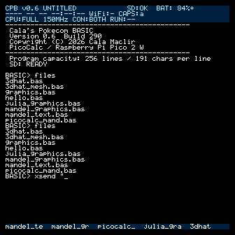

### 5.1 Filesメニュー

Control Centerの`Files`ではBASICファイルを一覧表示できます。

- Enter：LOAD
- `R`：LOADしてRUN
- F1～F10：選択中のファイルをクイックキーへ登録
- Esc：戻る

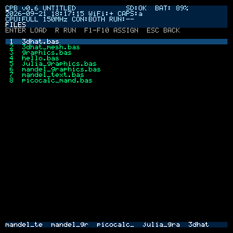

### 5.2 設定ファイル

`/RMBASIC.CFG`には表示、コンソール、Wi-Fi、NTP、Fキーなどの設定が保存されます。更新時には`RMBASIC.BAK`を利用して、書き込み途中の障害から復旧できるようにしています。

### 5.3 SD Cardメニュー

カード検出、マウント状態、直近のSDエラーを確認できます。カード交換後は`Remount SD card`、設定を読み直す場合は`Reload RMBASIC.CFG`を選びます。

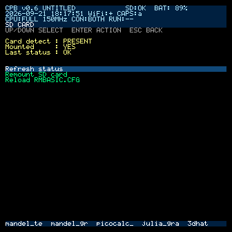

### 5.4 Program Storage

Version 0.8でも、BASICソースの格納先をProgram Storeとして抽象化しています。Control Centerの`Program Storage`でMode、Active backend、SD状態、プログラム名、行数、サイズを確認できます。

| モード | 説明 |
|---|---|
| AUTO | SDカードが利用可能ならSD CARD、利用できなければINTERNAL RAM |
| SD CARD | ソース本文をSDカード上の作業ファイルへ保持し、RAMには行indexを保持 |
| INTERNAL RAM | SDカードなしでも動作するRAM格納。最大256行 |

AUTOでSDカードを利用できる場合はSD CARDと同じ最大1,024行です。AUTOがRAM fallback中にSDカードを挿入しても、編集中のプログラムを自動移動しません。Storage Modeから明示的に切り替えます。

RAMからSD CARDへ切り替えるとき、変更済みプログラムがあればSave／Discard／Cancelを選びます。SD CARDからRAMへの切替では256行に収まるかを検査し、超える場合は`PROGRAM TOO LARGE FOR RAM MODE`として元のSD Program Storeを維持します。

SD-backed編集では、元ファイルを直接ランダム書き換えしません。SDカード上の作業ファイルと行indexを一組として管理し、編集やLOADは新しい状態の検証後に切り替えます。`NEW`は現在の編集内容を空にしますが、SAVEするまで元のBASファイルを削除しません。

SD CARD使用中にカードが取り外された場合は、自動的にRAMへ移行せず、`PROGRAM STORAGE SUSPENDED`として停止します。カードを再挿入し`Resume SD Storage`を選ぶか、明示的にRAMへ切り替えます。

現在Program Storeが使用中のファイルは、Wi-Fi File Server、XRECV、YRECVによる上書きや削除から保護されます。

### 5.5 400行プログラムの確認

`CPB_LARGE_400.BAS`（400 BASIC行、約6 KiB）は、AUTO + SD backendでLOAD、LIST、編集、RUN、SAVE、再LOADを実機確認済みです。FULL 150 MHzでの参考RUN時間は`[RUN] 0m 1.728s`でした。これは特定のテストプログラムと実機条件による参考値であり、すべての400行プログラムの実行時間を示すものではありません。

同プログラムを開いたままINTERNAL RAMへ切り替える操作は、RAMの256行上限を超えるため安全に拒否され、SDカード側のプログラムは維持されます。

## 6. USB CDC + Mass Storage

Version 0.8では、Pico 2 W側のMicro-USB端子から、USB CDCシリアルコンソールとUSB Mass Storage Class（MSC）を同時に提供します。Windowsでは同じUSB接続からCOMポートとSDカードのディスクを利用できます。

| 接続 | 用途 |
|---|---|
| Pico 2 W側 Micro-USB | USB CDCコンソール、UF2書き込み、USB Mass Storage |
| PicoCalc本体 USB Type-C | 電源・充電、CH340C経由のUARTシリアルコンソール |

USBの構成は次のとおりです。

```text
Pico 2 W native USB
+-- CDC : BASIC serial console
+-- MSC : SD card block device
```

MSCはWindows 11との実機試験で、SDカードの認識、読み取り、新規作成、上書き、削除を確認済みです。USB CDCのBASICコンソールも同時に利用できます。

### 6.1 USB Storageを開始する

1. Pico 2 W側のMicro-USB端子をWindows PCへ接続します。
2. Control Centerから`USB Storage`を開きます。
3. SDカードを使用中のBASIC処理がないことを確認します。
4. `Enable USB Storage`を選びます。
5. WindowsにSDカードのディスクが表示されたら、PC側でファイルを操作します。

停止中の画面では、SDカードの所有者はCPBです。

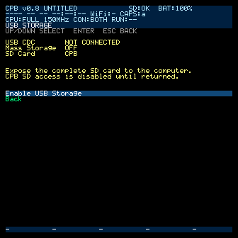

```text
USB Storage

USB CDC       CONNECTED
Mass Storage  OFF
SD Card       CPB

> Enable USB Storage
  Back
```

MSC動作中は、次の操作が表示されます。`Back`はメニュー末尾の1項目だけです。

```text
USB Storage

USB CDC       CONNECTED
Mass Storage  ACTIVE
SD Card       USB HOST

> Return SD to CPB
  Force Disconnect
  Back
```

### 6.2 Safe Ejectと通常返却

通常はWindows側でSDカードのディスクを安全に取り出してから、`Return SD to CPB`を選びます。ホストのEjectを確認できない場合は、SDカードの所有権を強制的に戻さず、次のメッセージを表示します。

```text
PLEASE EJECT USB DISK ON HOST FIRST
```

安全な返却では、MSCのメディア公開とraw I/Oを停止し、SDカードを同期してからFatFsを再マウントします。その後、SD-backed ProgramStoreのindexを無効化して再検証し、所有者をCPBへ戻します。

### 6.3 Force Disconnect

`Force Disconnect`は、Windows側で安全な取り出しができない場合だけ使用する緊急操作です。未送信の書き込みキャッシュが残っていると、ファイルシステムやファイルを破損する可能性があります。

確認画面の初期選択は必ず`Cancel`です。

```text
Force USB Storage Disconnect?

The host may have pending writes.
Filesystem data may be lost.

> Cancel
  Force Disconnect
```

この操作はMSCメディアだけを切断します。USBデバイス全体を切断・再列挙せず、USB CDCのBASICコンソールは維持します。開始後は新しいREAD10／WRITE10を拒否し、実行中のraw SD操作が終わってから同期、FatFs再マウント、ProgramStore再検証を行います。

### 6.4 MSC動作中の制限

MSC動作中、SDカードの所有者はUSBホストです。CPB側からSDカードへ同時アクセスしないよう、次の操作を制限します。

- `DIR`／`FILES`、`LOAD`、`SAVE`
- XMODEM／YMODEMのSDカード転送
- Wi-Fi File Server
- スクリーンショット保存
- SD-backed ProgramStoreの編集、LIST、RUN
- `STANDBY`

必要に応じて`SD CARD BUSY (USB STORAGE)`または同等のエラーを表示します。ProgramStoreは古いSD indexを信用せず一時停止し、SDカード返却後に再検証します。USBホストとCPBが同時にSDカードへアクセスする状態は作りません。

## 7. Control Center

空の`BASIC>`プロンプトでHOME（Shift+Tab）を押します。上下キーで選択、Enterで決定、EscまたはHOMEで戻ります。

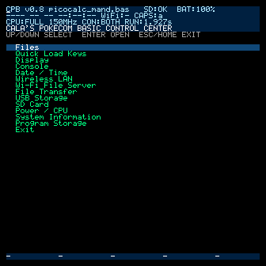

Version 0.8のメニュー：

1. Files
2. Quick Load Keys
3. Display
4. Console
5. Date / Time
6. Wireless LAN
7. Wi-Fi File Server
8. File Transfer
9. SD Card
10. Power / CPU
11. System Information
12. Program Storage
13. USB Storage
14. Exit

### 7.1 Quick Load Keys

F1～F10へファイルを登録し、`LOAD`または`RUN`を選べます。`RUN`はファイルを読み込んで実行します。

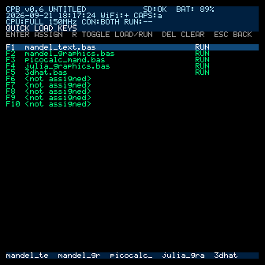

### 7.2 Display

ステータス表示、LCDバックライト、ステータステーマ、コンソールテーマを変更できます。名前付きテーマのほか、Advanced console RGBで色を細かく設定できます。

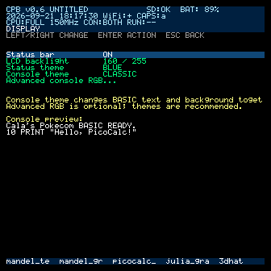

### 7.3 Console

| モード | 表示・入出力 |
|---|---|
| LCD ONLY | PicoCalc本体のみ |
| LCD + SERIAL | LCDとシリアルの両方 |
| SERIAL ONLY | シリアル中心。物理HOMEは有効 |

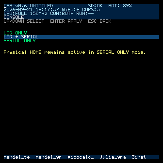

### 7.4 Date / Time

標準PicoCalcにはRTCが搭載されていません。Cala's Pokecom BASICは、オプションの外付けPCF8563 RTCを検出した場合に利用できます。RTCがなくてもソフトウェア時計を使用でき、Pico 2 WのWi-Fi接続中はNTP同期も利用できます。日時の一括設定は14桁です。

```text
YYYYMMDDHHMMSS
```

例：`20260919212400`

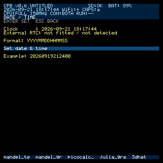

### 7.5 Power / CPU

| プロファイル | クロック |
|---|---:|
| FULL | 150 MHz |
| NORMAL | 100 MHz |
| ECO | 75 MHz |

変更は現在のセッションだけに適用され、再起動するとFULLへ戻ります。`STANDBY NOW`はRAMと実行状態を保持したまま、LCDとバックライトを消して待機します。復帰は任意のキーです。

`PICOCALC_MAND.BAS`の参考RUN時間は、FULL 150 MHzで2.482秒、NORMAL 100 MHzで3.598秒、ECO 75 MHzで4.709秒です。SD状態やBuild、プログラム内容により変動します。

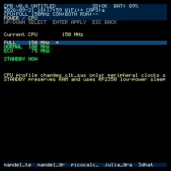

### 7.6 System Information

Version、Build、CPU、稼働時間、プログラム名、行数、コンソール、SD、バッテリー、Wi-Fi、日時、直近のRUN時間を確認できます。

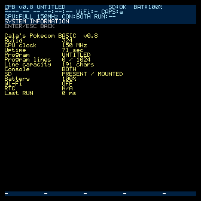

### 7.7 File Transfer

YMODEM／XMODEMをBASICコマンドと同じ転送処理で実行します。YMODEMを通常利用向け、XMODEMを互換・非常用として表示します。4つのメニュー項目は、Tera Termとの実機通信で確認済みです。

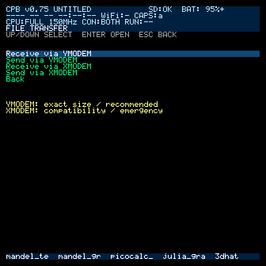

- `Receive via YMODEM`：ファイル名とサイズをBlock 0から取得
- `Send via YMODEM`：SDの一般ファイル一覧から送信対象を選択
- `Receive via XMODEM`：先に保存ファイル名を入力
- `Send via XMODEM`：SDの一般ファイル一覧から送信対象を選択

送信一覧にはBASだけでなくBMPなども表示します。Program Storeの内部作業ファイルやstaging fileは表示しません。転送開始前はEscで戻れます。転送中にTera TermからCANを受けた場合、またはタイムアウト・エラーになった場合も、結果を表示してControl Centerへ復帰します。

## 8. Wi-Fi

Control Centerの`Wireless LAN`から明示的に有効化します。

Wi-FiはPico 2 W内蔵のCYW43439が提供します。PicoCalc本体だけにWi-Fi機能が搭載されているわけではありません。

1. Wi-FiをONにします。
2. 周辺SSIDをスキャンします。
3. SSIDを選び、必要ならパスワードを入力します。
4. 接続してIPv4アドレスを確認します。
5. 必要に応じてNTP同期、タイムゾーン、NTPサーバーを設定します。

起動時のWi-Fiは常にOFFです。保存済みSSIDがあっても勝手に接続しません。現在、Wi-FiパスワードはSDカードのルートディレクトリにある`RMBASIC.CFG`へ平文で保存されます。

## 9. Wi-Fi File Server

ブラウザからSDカードのルートディレクトリを管理するHTTPファイルサーバーです。専用PCアプリは不要で、PCやスマートフォンのChrome／Edgeなどから利用できます。

### 9.1 起動

1. `Wireless LAN`でWi-FiをONにして接続します。
2. Control Centerの`Wi-Fi File Server`を開きます。
3. `Start File Server`を選びます。
4. 表示された`http://IP/?k=TOKEN`をブラウザで開きます。

未接続時は勝手にWi-FiをONにせず、接続が必要であることを表示します。

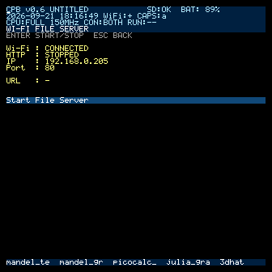

起動後はWi-Fi、HTTP、IP、Port、トークン付きURLを確認できます。

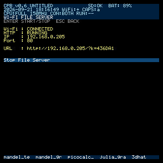

### 9.2 ブラウザ操作

- Refresh：一覧を再取得
- Choose Files／Upload：PCからSDカードへ転送
- Download：SDカードからPCへ転送
- Delete：確認後に削除

Upload／Downloadはファイル全体をRAMへ読み込まず、小さな固定バッファでストリーミングします。BAS、BMP、TXT、CFG、その他のバイナリを変換せず転送します。

Uploadは「元のファイル名 + `.TMP`」の一時ファイルへ受信し、Content-Length分を正常に書き終えてファイルを閉じた後だけ最終名へ置き換えます。通信切断やSDエラーが起きた場合、不完全な一時ファイルを削除し、既存の正常ファイルを保護します。

### 9.3 セキュリティと停止

File Serverを開始するたびに新しい短期トークンが生成されます。トークンはSDカードへ保存されず、停止または再起動で無効になります。API操作にも同じトークンが必要です。

次の場合はサーバーが停止します。

- `Stop File Server`を選択
- Wi-FiをOFF
- Wi-Fi接続が失われた
- STANDBYへ移行
- 再起動

同時に1クライアント／1ファイル操作を基本とします。HTTP転送中はSDカードを専有し、競合するSDカード操作は`BUSY`として扱われる場合があります。

## 10. YMODEM

YMODEMは、Tera Termを使うシリアル転送の推奨方式です。PC → PicoCalcとPicoCalc → PCの両方向で、Tera Termとの実機転送を確認済みです。CRC-16/XMODEMを使用し、Block 0でファイル名と10進ASCIIの正確なファイルサイズを伝えます。データ送信には基本1,024-byteのSTXブロックを使い、受信側は128-byte SOHと1,024-byte STXの両方を扱います。

YMODEMの最後のブロックにパディングがあっても、Block 0のサイズまでしか保存しないため、BAS・BMPなどを元と同じバイト数で転送できます。実機確認では、ファイル名、正確なファイルサイズ、BASICテキストの往復、およびパディングが保存ファイルへ残らないことを確認しています。

Version 0.8のYMODEMは1ファイル転送に対応します。複数ファイルをまとめて送るbatch転送には対応していません。

### 10.1 PCから受信

1. Tera Termで、Cala's Pokecom BASICの`BASIC>`が表示されるCOMポートを開きます。
2. PicoCalcで`YRECV`を実行するか、Control Centerで`Receive via YMODEM`を選びます。
3. Tera Termで`File → Transfer → YMODEM → Send`を選びます。
4. ファイルを選択します。PicoCalc側でファイル名とサイズを確認します。
5. `TRANSFER COMPLETE`と受信バイト数を確認します。

```text
BASIC> YRECV
YMODEM RECEIVE
WAITING FOR SENDER...
FILE: CPB_LARGE_400.BAS
SIZE: 6255 BYTES
RECEIVED 6255 BYTES
TRANSFER COMPLETE
```

受信は一時ファイルへ行い、通知されたサイズを完全に受け取り、ファイルを正常に閉じた後だけ最終名へ置き換えます。不正なファイル名、Program Storeが使用中のファイル、内部作業ファイルは拒否します。

### 10.2 PCへ送信

1. Tera Termで、Cala's Pokecom BASICの`BASIC>`が表示されるCOMポートを開きます。
2. Tera Termで`File → Transfer → YMODEM → Receive`を選び、待受状態にします。
3. PicoCalcで`YSEND "name"`を実行するか、Control Centerで`Send via YMODEM`からファイルを選びます。
4. 完了後、PC側とSDカード側のファイルサイズを比較します。必要ならSHA-256で完全一致を確認します。

```text
BASIC> YSEND "CPB_LARGE_400.BAS"
YMODEM SEND: CPB_LARGE_400.BAS
SIZE: 6255 BYTES
WAITING FOR RECEIVER...
SENT 6255 BYTES
TRANSFER COMPLETE
```

YMODEMのプロトコル処理、Block 0、正確なサイズ復元、エラー処理はhost testに加え、Tera Termとの実機往復転送でも確認済みです。

## 11. XMODEM-CRC

Wi-Fiを使用できない場合の互換・fallback用ファイル転送です。PC → PicoCalcとPicoCalc → PCの両方向で、Tera Termとの実機転送を確認済みです。128-byte SOHブロック、CRC-16/XMODEM、ACK／NAK／CAN／EOTを使用します。XMODEMはプロトコル内でファイル名と正確なファイルサイズを伝えません。

### 11.1 PCから受信

1. Tera Termで、Cala's Pokecom BASICの`BASIC>`が表示されるCOMポートを開きます。
2. PicoCalcで次を実行します。

```text
BASIC> XRECV "TEST.BAS"
XMODEM RECEIVE: TEST.BAS
WAITING FOR SENDER...
```

3. Tera Termで`File → Transfer → XMODEM → Send`を選びます。
4. `TEST.BAS`を選びます。
5. PicoCalcで`TRANSFER COMPLETE`と受信バイト数を確認します。
6. `DIR`、`LOAD "TEST.BAS"`、`LIST`で確認します。

受信は一時ファイルへ保存し、正常完了後だけ最終ファイルへ置き換えます。XMODEMの最終ブロックにある標準的な`0x1A`パディングは、BASICテキストとして扱う場合に支障がないよう処理されます。

### 11.2 PCへ送信

1. Tera Termで、Cala's Pokecom BASICの`BASIC>`が表示されるCOMポートを開きます。
2. PicoCalcで次を実行します。

```text
BASIC> XSEND "TEST.BAS"
XMODEM SEND: TEST.BAS
WAITING FOR RECEIVER...
```

3. Tera Termで`File → Transfer → XMODEM → Receive`を選びます。
4. 保存先を指定し、完了を待ちます。
5. PC側のファイルを元ファイルと比較します。

XMODEMはファイルサイズを通知できないため、PicoCalcからPCへ送る最終128-byteブロックは`0x1A`で埋められ、PC側ファイル末尾に残る場合があります。PicoCalcでBASを受信するときは末尾の標準的な`0x1A`を処理しますが、バイナリ完全一致が必要な通常転送にはYMODEMまたはWi-Fi File Serverを使用してください。

USB CDCを転送経路として選択した状態でUSB接続がない場合は、`USB NOT CONNECTED (OPEN USB COM PORT)`と表示されます。転送中は通常のコンソール入力・echo・BREAK判定を止め、選択したシリアル経路をXMODEMが専有します。

## 12. スクリーンショット

Alt+Sは現在のLCD全体を24-bit BMPとしてSDカードへ保存します。`SCREEN0001.BMP`から連番で空いている名前を選ぶため、既存画像は上書きしません。Control Centerやグラフィック実行中でも利用できます。

```text
BASIC> SCREENSHOT
SAVED SCREEN.BMP

BASIC> SCREENSHOT "MANDEL"
SAVED MANDEL.BMP
```

BASICプログラムでは`SAVEIMAGE`または`SAVE IMAGE`を使えます。

## 13. グラフィック

物理画面は320×320です。`SCREEN w,h`を使うと、指定した仮想座標を縦横比を保って中央へ割り当てます。

主な命令：`CLS`、`COLOR`、`COLORHSV`、`PSET`、`LINE`、`CIRCLE`、`BOX`、`PAINT`、`POINT`、`FLUSH`、`SLEEP`、`SCREEN`、`SAVEIMAGE`。

```basic
10 CLS
20 COLOR 255,255,255
30 LINE 0,0,319,319
40 CIRCLE 160,160,80
50 FLUSH
```

### 実行例

テキスト版Mandelbrot：

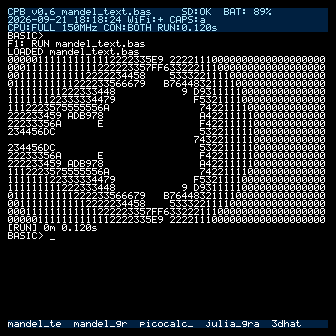

グラフィック版Mandelbrot：

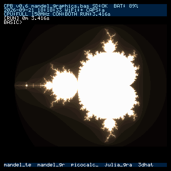

PicoCalc向けMandelbrot：

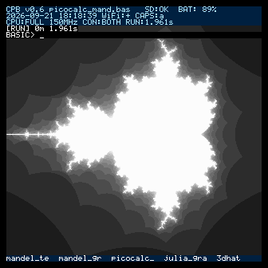

Julia集合の実行例：

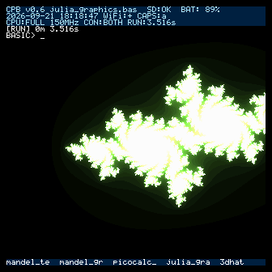

3DHATの実行例：

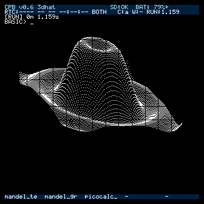

## 14. シリアルコンソール

Cala's Pokecom BASICは、Pico 2 WのネイティブUSB CDCとUART0を別々のシリアル経路として利用できます。USB CDCはPico 2 W基板上のUSB端子（Micro-USB）でPCへ接続します。UART0は115200 8N1で、PicoCalc本体のUSB Type-Cを使用する場合は、PicoCalc mainboardのCH340Cとシリアル切替回路を介します。出力をLCDとシリアルへ同時表示でき、PicoCalcキーボードまたはシリアル端末から入力できます。

```text
SERIAL
SERIAL ON
SERIAL OFF
SERIAL ONLY
CONSOLE LCD
CONSOLE BOTH
CONSOLE SERIAL
```

XMODEM／YMODEMでは、Tera TermでCala's Pokecom BASICの`BASIC>`が見えているCOMポートを使用します。Pico 2 W側USBのUSB CDCと、PicoCalc本体USB Type-CからCH340Cを介するUART0を同一経路として扱わないでください。ファームウェアはUSB CDC接続を検出した場合はUSBを優先し、それ以外はUART0を使用します。転送中は通常のREPL入力、echo、BREAK判定を停止し、転送処理が選択した経路を専有します。

## 15. STANDBY

`STANDBY`または`Power / CPU → STANDBY NOW`で待機します。File Serverを停止し、LCDとバックライトを消灯します。RAM、読み込んだBASICプログラム、VM状態は保持されます。任意のキーで復帰します。USB StorageがACTIVEの場合は、先にWindowsで安全な取り出しを行い、`Return SD to CPB`でSDカードを返却してください。

## 16. トラブルシューティング

### SD NOT AVAILABLE

- SDカードがFAT32形式か確認します。
- カードを挿し直し、`SD REMOUNT`を実行します。
- Control CenterのSD Card画面で`Last status`を確認します。

### USB NOT CONNECTED

Tera TermでCala's Pokecom BASICの`BASIC>`が表示されるCOMポートを開いてからXMODEM／YMODEMを開始します。USB CDCを使う場合はPico 2 W側USB、UART0を使う場合はPicoCalc本体USB Type-CのCH340C経路です。別の端末ソフトが同じCOMポートを使用している場合は閉じます。

### Return SD to CPBが拒否される

Windows側でUSBディスクを安全に取り出してから、もう一度`Return SD to CPB`を選びます。通常返却が拒否された状態でSDカードを抜いたり、電源を切ったりしないでください。

### USB Storageを安全に終了できない

可能な限りWindows側のファイル操作を停止し、Safe Ejectを再試行してください。どうしても取り出せない場合だけ`Force Disconnect`を使用します。未送信の書き込みが失われ、ファイルシステムが破損する可能性があります。確認画面の初期選択は`Cancel`です。

### YMODEM／XMODEMがTIMEOUTになる

- 先にTera TermでCala's Pokecom BASICの`BASIC>`が表示されるCOMポートを開きます。
- PicoCalcとTera Termで同じプロトコルを選びます。
- 受信側を待受状態にしてから送信を開始します。
- Cancel後は転送画面を閉じ、BASICプロンプトまたはControl Centerへ戻ったことを確認します。

### XMODEM転送後の末尾に`^Z`／`0x1A`が付く

XMODEMは正確な元ファイルサイズを伝えないため、最終128-byteブロックのパディングがPC側ファイルへ残る場合があります。これはXMODEMの仕様上の制約です。正確なファイルサイズを維持する場合は、YMODEMまたはWi-Fi File Serverを使用してください。

### File Serverを開始できない

- Wi-FiがONか確認します。
- SSIDへ接続し、IPアドレスが割り当てられているか確認します。
- 別のファイル操作中でないか確認します。

### ブラウザから開けない

- PicoCalcと端末が同じLANにいるか確認します。
- 画面に表示されたトークンを含むURLをそのまま入力します。
- File ServerがRUNNINGか確認します。
- STOP後や再起動後の古いURLは使えません。

### 転送中断後のファイル

Upload、XRECV、YRECVは一時ファイルを利用します。中断時は旧ファイルを維持し、不完全な一時ファイルを削除します。異常終了後は`DIR`で確認してください。

---

RetroMiniBASICおよびCala's Pokecom BASICは、いずれもCala Maclirが制作しました。
