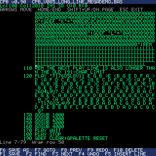
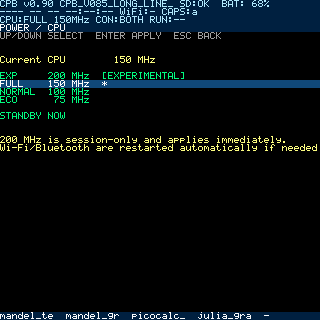
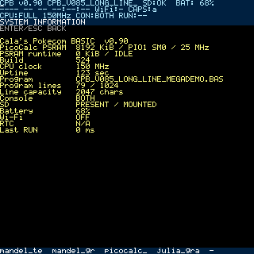

# Cala's Pokecom BASIC System
## Version 0.90
## System Manual / システムマニュアル

本書は ClockworkPi PicoCalc 上の Cala's Pokecom BASIC（CPB）v0.90 の操作、設定、保存、通信、診断を説明します。BASIC 文法は `programming-reference-ja.md` を参照してください。

## 1. System Overview

CPB は PicoCalc 単体で BASIC プログラムを作成・実行・保存できる環境です。LCD、キーボード、SD、USB、Wi-Fi、Bluetooth、音声、External RTC / I2C を一つのシステムにまとめています。

起動後は `BASIC>` prompt が表示されます。空の prompt で HOME（Shift+Tab）を押すと Control Center、`EDIT` と入力すると Full-Screen BASIC Editor が開きます。

## 2. Keyboardと共通操作

| 操作 | 機能 |
|---|---|
| Enter | 決定、BASIC行またはdirect commandの入力 |
| Esc | 戻る、キャンセル、実行中programのBREAK |
| Up / Down | 1項目移動、promptではcommand history |
| Shift+Up / Shift+Down | 対応一覧で1画面移動 |
| HOME（Shift+Tab） | 空のpromptでControl Center |
| F1〜F10 | promptではQuick Load Keys、Editorでは編集command |
| Alt+S | screenshotをSDへ保存 |

### Command history

`BASIC>` では直近24件を session 中だけ保持します。空行と連続する重複は登録されません。Up で過去、Down で新しい履歴へ移動し、履歴を開く前に入力していた draft へ戻れます。再起動すると消去されます。

## 3. Control Center

現行メニューは次の順です。

1. Files
2. Editor
3. Save Program
4. Save Program As...
5. Quick Load Keys
6. Display
7. Console
8. Date / Time
9. Audio
10. Wireless LAN
11. Bluetooth
12. Wi-Fi File Server
13. File Transfer
14. USB Storage
15. SD Card
16. Firmware
17. Power / CPU
18. Board LED
19. System Information
20. PSRAM Diagnostics
21. Program Storage
22. Exit

Up / Down で移動し、Enter で選択します。Shift+Up / Shift+Down は長い一覧を1画面移動します。

## 4. BASIC prompt

行番号付きの入力は program へ登録され、行番号なしは direct mode で即時実行されます。

```basic
10 PRINT "HELLO"
20 GOTO 10
RUN
```

空の行番号だけを入力すると、その行を削除します。`LIST`、`RUN`、`NEW`、`SAVE`、`LOAD` などの REPL command は Programming Reference を参照してください。

prompt の interactive line editor と direct mode は最大191文字です。SD ProgramStore の長い行は Full-Screen Editor または PC で編集します。

## 5. Program Storage

| Mode | 最大行数 | 1行本文 | 特徴 |
|---|---:|---:|---|
| INTERNAL RAM | 256 | 191 characters | SDなしでも利用可能 |
| SD CARD | 1,024 | 2,047 characters | 大規模program、長い行 |
| AUTO | 選択backendに従う | 選択backendに従う | SD利用可ならSD、不可ならRAM |

本文長には行番号とその後の空白を含みません。上限を1文字でも超える入力は切り詰めず拒否します。

191文字を超える行を含む SD program を RAM へ切り替えると `LINE TOO LONG FOR RAM` で拒否し、元の SD source は保持されます。

## 6. Storage Continuity

編集中programの状態をSDへ安全に退避し、異常終了や再起動後の復元候補として提示します。保存は temporary file と rename を使い、途中状態を current session として採用しにくい設計です。

復元候補が表示されたら内容と current file を確認し、Restore または Discard を選びます。USB Storage を開始する前には編集中内容を明示的に保存してください。

## 7. Files

Files には2つのmodeがあります。

| Mode | 用途 | 主な操作 |
|---|---|---|
| PROGRAMS | BASIC program中心 | Enter LOAD、R RUN、E EDIT、N RENAME、Del DELETE、I INFO、F REFRESH |
| DIRECTORY | root上の全対象file | P PLAY/STOP、N RENAME、Del DELETE、I INFO、F REFRESH |

Left / Right でmodeを切り替えます。v0.90 は root-only で、directory navigation は行いません。

### ファイル名

- 最大79文字
- ASCII の内部空白を許可
- 先頭・末尾の空白とドットは禁止
- `..`、`/`、`\\`、制御文字、非ASCII文字は禁止
- program名は必要に応じて `.BAS` を補完

Rename と Delete は current program への影響を考慮して処理されます。Delete は確認画面を表示します。大文字・小文字だけを変える rename は FAT の条件により制限があります。

## 8. Full-Screen BASIC Editor

起動方法:

- `BASIC>` で `EDIT`
- `Control Center → Editor`
- Files PROGRAMS で対象を選び `E`

Editor は program 全体の複製を作らず、現在行用の約2 KiB buffer と ProgramStore を使用します。長い logical line は 320×320 LCD の幅に合わせて折り返されます。行番号prefixを除く本文は1画面41文字幅が目安です。



### Editorキー

| キー | 機能 |
|---|---|
| Arrow keys | 文字・visual row単位の移動 |
| Shift+Up / Shift+Down | 1画面移動 |
| Home / End | logical lineの先頭 / 末尾 |
| Backspace / Delete | 文字削除 |
| F1 | Save。untitledならSave As |
| F2 | Find |
| F3 | Next match |
| F4 | Undo |
| F5 | Insert Line |
| F6 | Save As |
| F7 | Goto line |
| F8 | Previous match |
| F9 | Redo |
| F10 | Delete Line（確認あり） |
| Esc | 終了。未保存なら確認 |

Enter は logical line を分割しません。新しい行を追加する場合は F5 を使います。

### Undo / Redo

PicoCalc PSRAM が利用できる場合、Editor は128 KiBを履歴用に取得し、おおむね31件の coalesced Undo と31件の Redo を保持します。連続入力はまとめられる場合があります。履歴はエディタを閉じると破棄され、program本体はPSRAMへ移動しません。

PSRAMがない場合も編集と保存は利用できます。F4 / F9 は無効で、状態行に理由が表示されます。

### 性能

v0.90 はカーソルだけの移動を部分再描画し、key repeat中の全画面描画を抑えます。SD viewport は1回の lease / open / close でまとめて読み出します。性能測定用 UF2 は通常利用向けではありません。

## 9. Quick Load Keys

F1〜F10 に `.BAS` と LOAD / RUN を割り当てられます。prompt で押すと登録内容を実行します。Editor が開いている間は Editor command が優先されます。

設定は `RMBASIC.CFG` の `[fkeys]` に保存されます。

## 10. Display

Backlight、Theme、Console foreground / background、status表示を設定します。Backlight は安全な下限を持ちます。screenshot は Alt+S でSDへ保存します。

## 11. Console

| Mode | 出力先 |
|---|---|
| LCD | PicoCalc LCD |
| SERIAL | USB CDC / serial console |
| BOTH | LCDとserialの両方 |

入力元と出力先は転送処理にも関係します。File Transfer の AUTO は、commandを開始した入力元を優先します。

## 12. Date / TimeとRTC

RTC source は AUTO、EXTERNAL、INTERNAL、OFF から選択します。External RTC はI2C経由で扱い、addressも設定できます。Wi-Fiが接続されている場合はNTPから時刻を取得でき、timezone offsetは分単位で指定します。

RTC hardwareが見つからない場合は `RTC N/A` と表示されます。配線、address、source設定を確認してください。

## 13. Audio Settings

v0.90 のAudioは3層です。

| 設定 | 範囲 / 既定 | 対象 |
|---|---|---|
| Master | OFF、10〜100 / 70 | BEEP、PLAY、WAV、MP3、診断音 |
| WAV/MP3 | 10〜100 / 50 | file playback |
| PLAY | OFF、10〜100 / 100 | MML PLAY |

WAV / MP3 の出力ceilingは PLAY の2倍です。Masterはすべてに共通して最後に適用されます。

`Key Click` は OFF / SOFT / CLASSIC / SHARP、`Startup WAV` は起動時の `STARTUP.WAV` を制御します。

### WAV / MP3 playback

`WAVPLAY "filename"` は拡張子だけでなく内容を判定します。PCM WAV と MP3（44.1 / 48 kHz、mono / stereo）をstreaming再生します。Files DIRECTORYでは対象を選び `P` で再生・停止できます。

MP3開始時は必要に応じて200 MHzを自動要求し、停止後に元のclockへ戻ります。

## 14. Wireless LAN

2.4 GHz WLANへ接続します。SSIDとpasswordは設定へ保存できますが、接続状態は session-only で、起動時はOFFです。

接続後はNTP、Wi-Fi File Serverを利用できます。接続できない場合はSSID、password、2.4 GHz、電波状態を確認します。

## 15. Bluetooth Keyboard

Bluetooth Classic HID / BLE HID Keyboard に対応します。Pair、Reconnect、Disconnect、Forget、JIS / US layoutを選択できます。Paired DevicesにはKeyboardとして登録された機器だけを表示します。

v0.90のBluetoothはkeyboard入力用途です。旧版のClassic SPP file transferとは役割が異なります。

## 16. Wi-Fi File Server

Wi-Fi接続後、HTTP File Serverを開始すると同一LANのbrowserからSD rootへupload、download、deleteできます。画面に表示されるURLへ接続してください。

利用後はserverを停止します。公開ネットワークでは使用しないでください。

## 17. File Transfer

| Protocol | Send | Receive |
|---|---|---|
| XMODEM | single-file | single-file |
| YMODEM | single-file | single / multi-file batch |

transportは AUTO、USB CDC、UART0 から選択します。AUTOはcommandの入力元を尊重し、本体から開始した場合は接続中USB CDC、なければUART0を選びます。

YMODEM receiveはheaderのsizeを使用し、block paddingを保存しません。

## 18. USB Storage

SDカードをPCへUSB Mass Storageとして公開します。開始前にprogramと設定を保存してください。MSC中はCPBからSDへ通常アクセスできず、CPU profile切替も拒否されます。

終了後はPC側で安全な取り外しを行い、CPBメニューから停止してSDを再mountします。

## 19. Firmware

`Enter BOOTSEL` は次回書き込み用の `RPI-RP2` modeへ移行します。対応前の古いfirmwareでは物理BOOTSELが必要です。通常版とeditor performance計測版を取り違えないでください。

## 20. Power / CPU

| Profile | Clock | 用途 |
|---|---:|---|
| ECO | 75 MHz | 低消費電力 |
| NORMAL | 100 MHz | 軽量処理 |
| FULL | 150 MHz | 起動時既定、通常利用 |
| EXP | 200 MHz | 高負荷、MP3、実験的 |



v0.90 はprofile切替時に必要ならCYW43関連のWi-Fi / Bluetooth / Board LED serviceを停止・再初期化します。利用者が先に手動停止する必要はありません。USB Mass Storage中、PSRAM診断や競合処理中は安全のため切替を拒否します。

CPU profileは保存されず、再起動時は必ず150 MHzへ戻ります。

## 21. Board LED

Pico 2 W のLEDはCYW43 deviceを共有します。OFF、ON、HEARTBEATを選べます。HEARTBEATは約1秒ごとに120 ms点灯します。CPU profile切替後も必要に応じて復旧します。

## 22. System Information

表示項目:

- CPB version
- PicoCalc PSRAM容量、PIO state machine、bus clock
- PSRAM runtime使用量とowner
- Build番号
- CPU clock、uptime
- Current programとdirty marker
- Program lines、line capacity
- Console、SD、battery、Wi-Fi、RTC
- Last run time



Editorを開いていない通常時は `PSRAM runtime 0 KiB / IDLE`、Editor履歴取得中は `128 KiB / EDITOR HISTORY` が目安です。

## 23. PSRAM Diagnostics

| Test | 範囲 | 用途 |
|---|---|---|
| Quick | 1 MiB | 短時間の基本確認 |
| Full | 検出全容量 | 全領域の確認 |
| 3-pass stress | 検出全容量×3 | 安定性確認 |

診断はPSRAM内容をpatternで上書きします。Editorを終了し、確認画面を読んでから実行してください。BASIC program本体はProgramStore上にあり、PSRAMには置かれません。

起動時probeは末尾16 bytesだけを検査し、元の内容を復元します。検出失敗時は通常機能を継続します。

## 24. RMBASIC.CFG

設定はSD rootの`RMBASIC.CFG`へ保存されます。主なkeyは次のとおりです。

```ini
[ui]
program_storage=AUTO
status=on
backlight=255
board_led=HEARTBEAT
theme=0
console_fg=FFFFFF
console_bg=000000
console=BOTH

[rtc]
rtc_source=AUTO
rtc_address=0x51

[audio]
audio_volume=70
wav_volume=50
play_volume=100
key_click=SOFT
startup_wav=off

[bluetooth]
keyboard_layout=JIS

[wifi]
wifi_enabled=off
wifi_ssid=
wifi_password=
wifi_auto_rtc=off
wifi_timezone_minutes=540
wifi_ntp_server=pool.ntp.org

[fkeys]
F1=DEMO.BAS,run
```

`cpu_mhz` と `wifi_enabled=on` が旧設定に残っていても、v0.90は安全のため起動時にCPU 150 MHz、Wi-Fi OFFとします。

## 25. Troubleshooting

### EditorでUndoできない

System InformationでPSRAMを確認します。`NOT AVAILABLE`なら編集自体は可能ですがUndo / Redoは使えません。診断中やerror後はEditorを閉じて再度開きます。

### 長い行を入力できない

promptは191文字です。SD ProgramStoreとFull-Screen Editorを使用するか、PCで編集して転送します。

### SDでStorage Busyになる

音声、USB Storage、file transfer、診断など同時にSDを使う機能を停止します。Filesのpreviewはv0.90でlease競合を避けるよう改善されています。

### MP3が再生できない

44.1 / 48 kHz、mono / stereoのMP3か確認します。USB Storageを停止し、SD mountとCPU切替errorを確認します。

### CPU profileを切り替えられない

USB Mass StorageまたはPSRAMの排他的処理を終了します。通常のWi-Fi / Bluetooth / LEDはv0.90が自動的に再起動します。

### Wi-FiまたはBluetoothが戻らない

profile切替後に数秒待ちます。再接続に失敗した場合は各メニューから再接続し、最後に再起動します。

### RTC N/A

source、I2C address、配線、電源を確認し、I2C SCANでdeviceを確認します。

### PDFと画面のキー表示が違う

PDF表紙がVersion 0.90であることを確認してください。旧版ではEditorのFキー割当が異なる場合があります。
